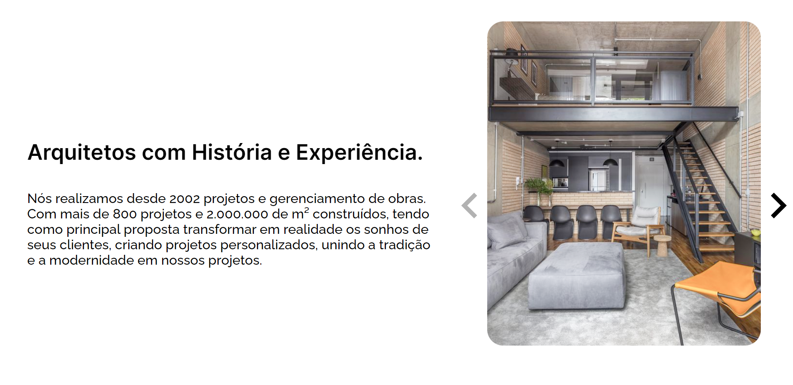

	

	<h1>Site de uma empresa de arquitetura fictícia para captação de possíveis novos clientes</h1>

### O que é? 🤔
Site de captura de possíveis novos clientes para uma empresa de arquitetura, foi utilizado html, css e javascript, integrados ao Google Sheets o qual armazena em uma planilha os e-mails de clientes para um contato posterior por parte da empresa.

### Quais tecnologias foram usadas? 💻
- HTML5
- CSS3
- Javascript

### Está online? 📡
SIM! Basta [clicar aqui](--------------------) para visualizar o site que está hospedado nos servidores da Netlify.

by Murillo Couto 
[GitHub](https://github.com/MurilloCouto)
